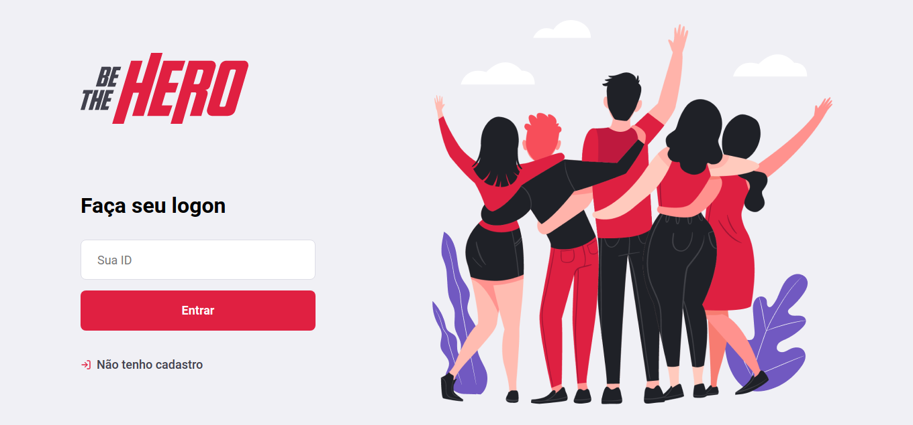
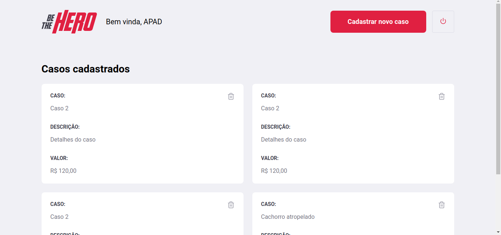
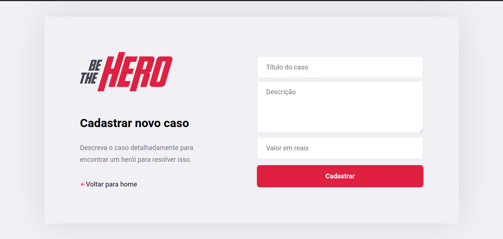

# Semana-Omnistack-11.0

## Demonstrativo do projeto

## Tecnologias
Esse projeto foi desenvolvido com as seguintes tecnologias:
- Node.js
- React
- React Native
- Expo

## Projeto
O BeTheHero é um projeto que visa conectar pessoas que desejam fazer contribuições monetárias a ONG's (Organizações não governamentais) que precisam de ajuda.
